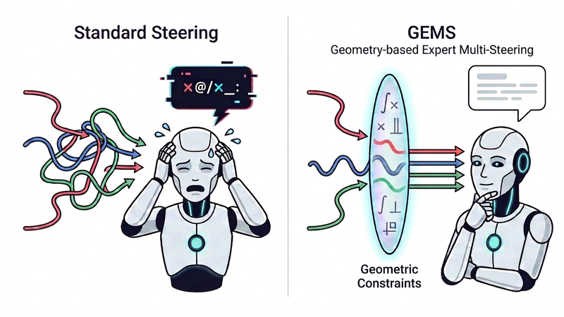

# GEMS: Geometric Constraints Enable Multi-Semantic Superposition in LLMs

[](https://arxiv.org/abs/2606.19946) [](LICENSE)

Existing unoptimized pure forward-pass interventions for LLMs can inject a single behavioral direction, but the effect is hard to control precisely, and injecting multiple directions simultaneously almost always leads to collapse. GEMS addresses this through geometric constraints (norm-preserving orthogonalized superposition, a Gaussian envelope, and targeted o_proj injection), enabling stable, controllable multi-directional steering without any training or fine-tuning — making it a reality to shape tone, style, and content constraints in a single generation pass. The method architecture is model-agnostic and can in principle scale to LLMs of any size, opening up possibilities for exploring a wider range of applications.

<p align="center">
  
</p>

## Install

```bash
git clone https://github.com/LuLu663939/gems-multi-semantic-steering.git && cd GEMS
bash scripts/setup.sh
```

This creates a conda env `gems` with PyTorch 2.5.1 + Transformers 5.9.0, and installs the package in editable mode.

## Play

```bash
source $(conda info --base)/etc/profile.d/conda.sh
conda activate gems
python demo.py                # downloads model on first run
```

Opens an interactive console. Model loads once, then you can directly adjust prompt, experts, and intensities from the menu — press [R] to run with the default PR crisis scenario, or [D] for the full progressive demo. The console guides you through each step.

**Or run from command line** (single-shot, saves to `./data/examples/`):

```bash
python demo.py \
  --expert "Be deeply empathetic" \
  --expert "Take structural accountability" \
  --expert "Use minimal rhetoric" \
  --prompt "We are shutting down the community service. Specifically,"
```

## Reproduce

**Experiment environment:** PyTorch 2.5.1+cu121, Transformers 5.9.0.

For file-by-file guide (what each script does, what each data file contains), see [REPRODUCE.md](REPRODUCE.md).

```bash
# Table 3: GSM8K 8-track ablation (single question, quick check)
python code/evaluation/gsm8k_single.py --question-idx 0

# Table 3: GSM8K 8-track ablation (full 50 questions)
python code/evaluation/gsm8k_eval.py

# Table 4: Wikitext-2 PPL 6-track
python code/evaluation/ppl_eval.py
```

All configurations are locked to paper defaults. Outputs written to `data/tables/`.

## Project Structure

```
GEMS/
├── demo.py                   # Entry point — run this first
├── gems/                     # Core library (hooks, extraction, utils)
├── code/
│   ├── evaluation/           # Paper reproduction (GSM8K, PPL)
│   └── diagnostics/          # Section 2 failure mode diagnostics
├── data/                     # Pre-computed results, organized by paper section
├── scripts/setup.sh          # One-click environment setup
├── AGENTS.md                 # Agent integration guide
├── REPRODUCE.md              # File-by-file reproduction guide
└── LICENSE
```

## Citation

If you find this work useful, please cite:

```bibtex
@misc{deng2026gems,
  title={GEMS: Geometric Constraints Enable Multi-Semantic Superposition in LLMs},
  author={Yu Deng},
  year={2026},
  eprint={2606.19946},
  archivePrefix={arXiv},
  primaryClass={cs.CL}
}
```

## License

MIT

> **Note:** GEMS reshapes the output distribution within the model's existing capability space rather than creating new capabilities. Steering effects may vary across scenarios and model sizes. If you are interested in my research, or adapting GEMS to larger models and exploring new applications, feel free to reach out: lulu663939@pm.me
